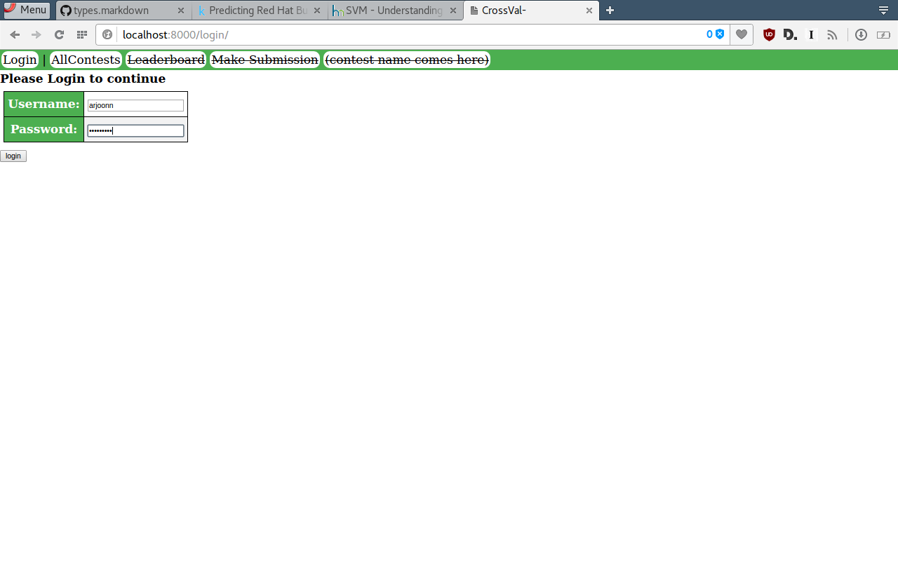
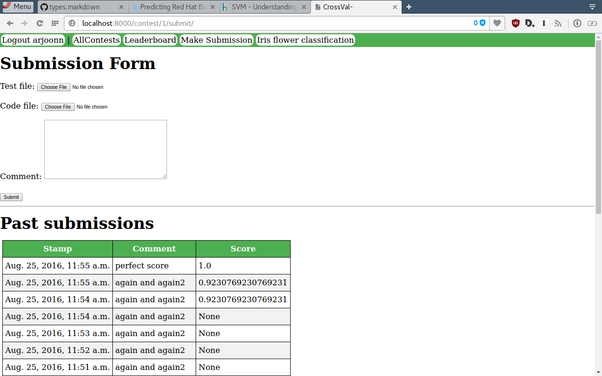

CrossValidation Platform
========================

Hold local Machine Learning contests in a kaggle like format.

Installation
------------

`setup.sh` should do most of the things

Usage
-----

- Set up 
- go to /admin
    - add contest
    - Fill in the details
        - Ground Truth: this is the file expected from the perfect player submission
        - Check script: This is used to score the submission.
            It is provided with ground_path, given_path, pd, metrics in it's namespaces
            It must set the score variable
        - Resources:
            - you are expected to provide a `train.csv` and `test.csv` file.
            - The participant trains her model on `train.csv` and predicts for `test.csv`.
            - The predictions are uploaded and scored agains `ground_truth`

Contribution
------------

Please do so!

TODO
----

- cleaning and validating the submissions before running scoring
- Public Private lb split

Screenshots
-----------

